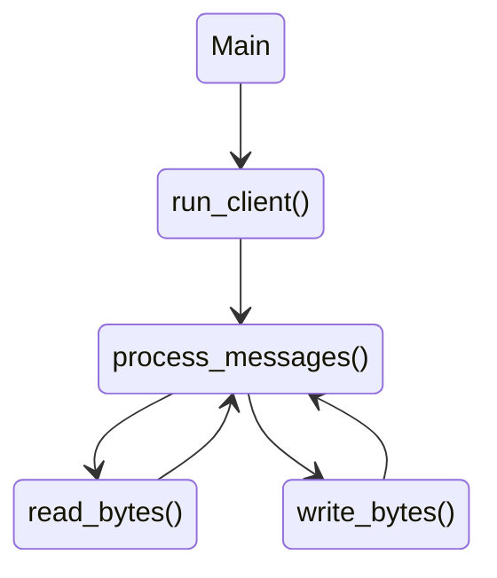

# About the project

This is a proposed solution to the [P2P node handshake](https://github.com/eqlabs/recruitment-exercises/blob/master/node-handshake.md) recruitment exercise by Equilibrium.

Main characteristics:
- Targets [AvalancheGo](https://github.com/ava-labs/avalanchego) nodes
- TLS connection
- Asynchronous handling of socket for read and write operations
- DoS protection techniques
- Unit tests
- Configuration through YAML file and from command line

# Architecture

The project includes the following main components:
- a `main()` function that creates a client instance, connects to the target node, and waits for the client to stop (the client runs on its own separate thread)
- a `avalanche` module that contains most of the logic of the P2P protocol
- a `utils` module that contains some helper functions, in particular the ones for mocking the time and be able to run tests in a convenient way

Inside the `avalanche` module:
- `p2p` includes the high level logic of the application, it implements the `AvalancheClient` that is responsible of processing messages, handling state transitions, spawning the low level `NetworkHandler`.
- `network` implements the logic to read/write bytes at network level, communicating with the `AvalancheClient` to queue the deserialization of received messages and serialize outgoing messages produced; it runs on two different threads, one for reading and one for writing
- `tls` is mostly an helper to handle some details of the TLS connection that is required by Avalanche nodes
- `config` that is in charge of handling the configuration parameters, both passed as arguments from the command line and set through the YAML file

Serialization and deserialization of messages is performed through the `protobuf` crate as required by the Avalanche P2P protocol.



Note that the threads mentioned above communicate through `std::mpsc` channels and the only shared resource is the TLS stream, accessed through an `std::sync::Arc` thread-safe pointer and a `Mutex`.

In order to prevent **DoS attacks**, the `std::mpsc` channels are created with synchronous senders (but handled asynchronously) to set a maximum size to the queue of messages and avoid making it grow indefinitely, eventually causing *out-of-memory* errors.

For similar reasons, the application checks the **size of incoming messages** by deserializing the length written in the header and eventually disconnecting the peer if it's found acting maliciously (e.g. asking to deserialize a message that is too big).

Additionally, the current implementation disconnects peers that don't complete the handshaking in a limited time or that don't send any message for a long time.

# Building from source

```sh
git clone git@github.com:ptagl/p2p-node-handshake.git
cd p2p-node-handshake
cargo build
```

As a preliminary build step, the Avalanche P2P `protobuf` specification that includes the definition of protocol messages are automatically converted into Rust structs for usage in the project.

Note: the project has been tested with Rust `1.73.0`.

# How to run

## Running the remote Avalanche node
The application needs to connect to an up-and-running AvalancheGo node configured for using the local testnet as blockchain id (`--network-id=local`).

The AvalancheGo client can be downloaded from the [official repo](https://github.com/ava-labs/avalanchego), but you can find a Linux binary in the `bin` folder (version `1.10.17`).

For testing purpose, in order to get the most interesting logs related to the handshaking phase, it is recommended to run the AvalancheGo client with the following parameters:

```sh
./avalanchego --network-id=local --log-level=verbo | grep -e "network.go" -e "peer.go"
```

This command sets the right network ID, enables extended logging, and filters the lines that have to do with networking and peer management.

## Running the application

Once the Avalanche node is up and running, it is possible to run the P2P Node Handshaker:

```sh
cargo run
```

By default, the application tries to connect to a local node listening on the port 9651, but this behavior can be configured from command line:

```sh
cargo run -- --ip-address "127.0.0.1:9651"
```

## Configuring the application

Some options are available from the command line, check the help for further details:

```sh
cargo run -- --help
```

Settings are also available through the `config.yaml` file.

## Checking if it works

Apart from relying on the logs printed by the handshaker itself, it is possible to check the logs of the AvalancheGo client to see if the connection is established and the handshaking is completed, but it requires some preliminary knowledge of the [P2P protocol](https://pkg.go.dev/github.com/ava-labs/avalanchego/network#section-readme) to understand that the log line

```sh
skipping peerlist ack as there were no tracked peers
```

can be considered as a proof that handshaking was successful.

A more convenient way is to query the AvalancheGo directly, for instance by opening a new terminal and running

```sh
curl -X POST --data '{
    "jsonrpc":"2.0",
    "id"     :1,
    "method" :"info.peers",
    "params": {
        "nodeIDs": []
    }
}' -H 'content-type:application/json;' 127.0.0.1:9650/ext/info
```

As a third option, it is possible to check the REST [health API](http://127.0.0.1:9650/ext/health).

While not killed, the application keeps the connection open and exchanges ping/pong messages with the target, unless the `--connection-duration` has been set to a non-zero value. It triggers the disconnection after N seconds since the successful completion of the handshake procedure.

It is possible to close the application also by killing the AvalancheGo client.

# Tests

Unit tests are available and can be run with

```sh
cargo test
```

# Improvements

A lot of areas of this project could be improved, for instance:
- Improve error handling (e.g. make the Main function detect whether the connection was closed intentionally by the local application or for any other reason)
- Improve the DoS protection for out-of-memory issues related to the P2P message queues; MPSC channels currently don't expose a function to get the total size of the queue, we should find something supporting this feature or implement it on our own
- Improve logging and get rid of `println!()` calls
- Define some traits to simplify eventual developments of additional clients (Bitcoin, Ethereum, etc.) and increase reusability
- ...

# References
**Avalanche**
- [Network Protocol](https://docs.avax.network/reference/standards/avalanche-network-protocol)
- [Networking](https://pkg.go.dev/github.com/ava-labs/avalanchego/network#section-readme)
- [Protobuf definitions](https://buf.build/ava-labs/avalanche/file/main:p2p/p2p.proto)
- [AvalancheGo Config Flags](https://docs.avax.network/nodes/configure/avalanchego-config-flags)
- [Issuing API Calls](https://docs.avax.network/reference/standards/guides/issuing-api-calls)
- [Info API](https://docs.avax.network/reference/avalanchego/info-api#infopeers)
- [AvalancheGo on GitHub](https://github.com/ava-labs/avalanchego)